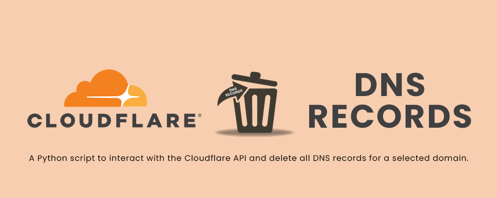

# Cloudflare Bulk DNS Record Deletion Script

A Python script to interact with the Cloudflare API and delete all DNS records for a selected domain.

## Features

- **List Domains:** Fetches a list of all domains associated with your Cloudflare account.
- **Total DNS Records:** Displays the total number of DNS records for a selected domain.
- **Delete All DNS Records:** Allows the user to choose a specific domain and delete all its DNS records.

## Requirements

- Python 3.x
- `requests` library
- `tqdm` library
- Cloudflare Global Api Key
- Cloudflare Mail

## How to Use

1. **Clone the Repository**
    ```bash
    git clone https://github.com/MannyHackers/Bulk-Delete-CF-DNS-Records
    ```
	
2. **Navigate to the project directory**
    ```bash
    cd Bulk-Delete-CF-DNS-Records
    ```

3. **Install Dependencies:** Ensure that you have Python 3.x installed. Install the required dependencies using:
    ```bash
    pip install -r requirements.txt
    ```

4. **Run the Script:**
    ```bash
    python CF_DNS_DEL.py
    ```
5. **Cloudflare Credentials:**
    - Enter your Cloudflare Global API Key and Cloudflare email when prompted.
	- To Get CF Global Api Key [Click Here](https://dash.cloudflare.com/profile/api-tokens)

6. **Select Domain:**
    - The script will display a List of Domain Name, Domain ID and their DNS Records.
    - Enter the ID of the domain for which you want to delete all DNS records.

7. **Confirmation:**
    - Confirm the deletion (yes/no), and the script will delete all DNS records for the selected domain.


## Credit

[Cloudflare API](https://dash.cloudflare.com/profile/api-tokens).

This script was developed by [MannyHacker](https://MannyHacker.t.me/). 
Feel free to contact me for any inquiries or support.

---

**Note:**
This script interacts with the Cloudflare API. Make sure you have a valid Cloudflare Global API Key and email.


**Disclaimer:** Use this script at your own risk. The author is not responsible for any unintended data loss or consequences resulting from the use of this script.

## Public Use License

## License

This project is licensed under the GNU General Public License v3.0


